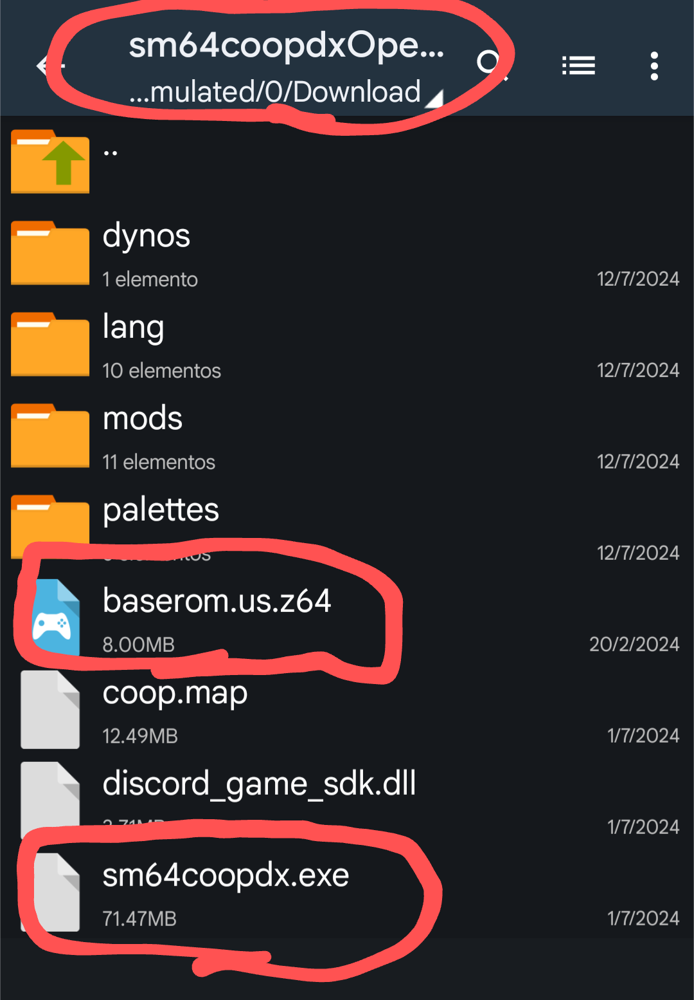
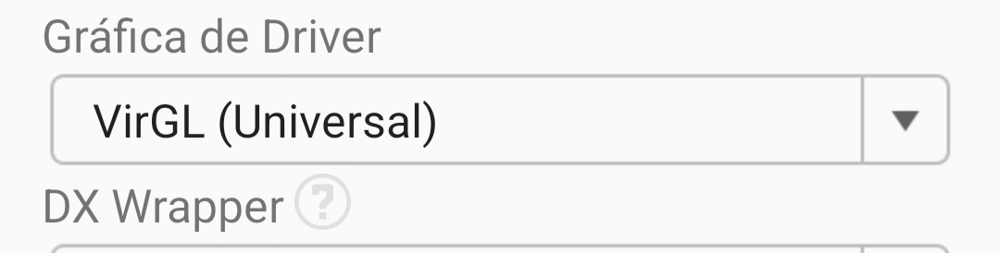
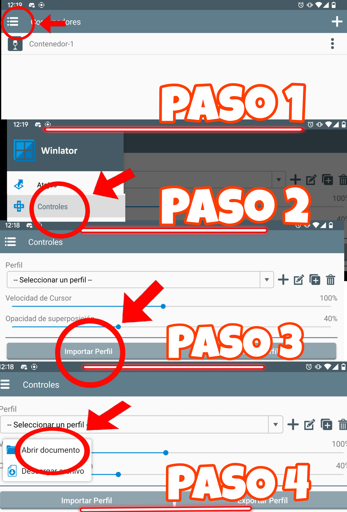

# web
[https://retired64.github.io/coopdx-android/](https://retired64.github.io/coopdx-android/)
# SM64COOPDX Android Port

¡Bienvenido al port de SM64COOPDX para Android! Este proyecto permite disfrutar de Super Mario 64 en modo multijugador de hasta 16 jugadores en dispositivos Android. Creado por Agent.X, SM64COOPDX es una emocionante adaptación que te permite revivir este clásico con tus amigos.

## Requisitos Mínimos Indispensables para Jugar

- **Memoria RAM:** 4 GB mínimo (6 GB recomendado)
- **Procesador:** Snapdragon 600 o equivalente
- **Espacio disponible:** 2 GB
- **Guía:** Sigue el [video de YouTube](https://youtu.be/BNsbLSQZ6Ik) para más información

## Paso 1: Descargar los archivos

- Ve a [Descargar sm64coopdx OpenGL](https://www.mediafire.com/file/cub99on08nph8or/sm64coopdx_v1.0_Windows_OpenGL.zip/file)
- Descomprime el archivo en tu almacenamiento interno y añade tu `baserom.us.z64` dentro del archivo descomprimido

## Paso 2: Iniciar el juego

- Ejecuta `sm64coopdx.exe` dentro del emulador en español **WINLATOR** (versión 7.1)
- Coloca una ROM US de Super Mario 64 para obtener todos los assets
- ¡Disfruta jugando SM64COOPDX!

### Nota:
Coloca la ROM en la carpeta del juego `.exe`. Esto solo es necesario la primera vez que abres el juego.

## Preguntas Frecuentes

Si tienes alguna pregunta sobre cómo instalar mods, hostear o unirte, consulta:

## Configurar WINLATOR

Descarga [winlator](https://www.mediafire.com/file/gickqu6pm5mw1yc/win-es_src.apk/file)

**Nota:** Si tu procesador no es Snapdragon, deberás utilizar el driver gráfico **VirGL Universal**. También deberás descargar los controles configurados para SM64COOPDX e importarlos en la sección de controles de WINLATOR.

[Descargar controles androidx.icp](androidx.icp)

## Créditos

- [BrunoSX Dev85](https://winlator.org)
- [Agent X](https://sm64coopdx.com)
- [Retired64](https://youtube.com/@retired64)

### Uso y Derechos

Créditos de uso y creador de la guía: © 2024 Retired64. Todos los derechos reservados. Desarrollado por [Retired64](https://retired64.github.io/coopdx-android).
